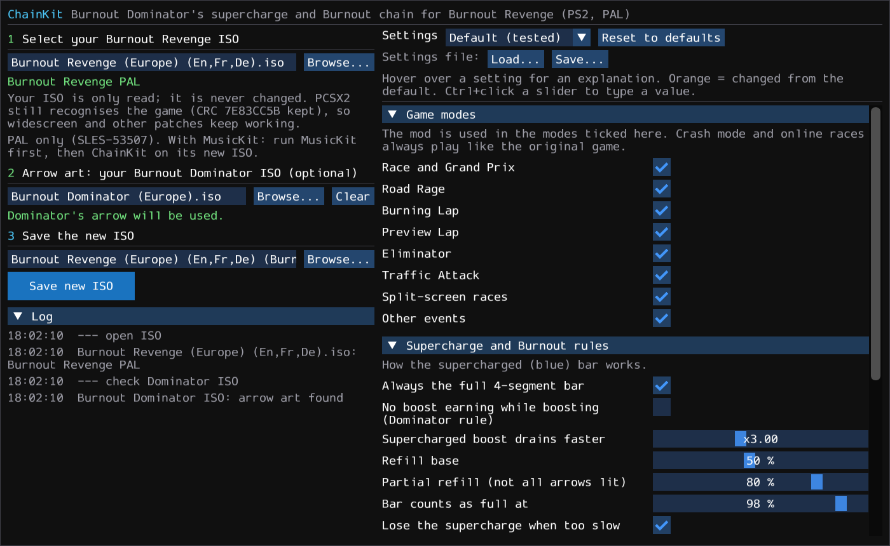
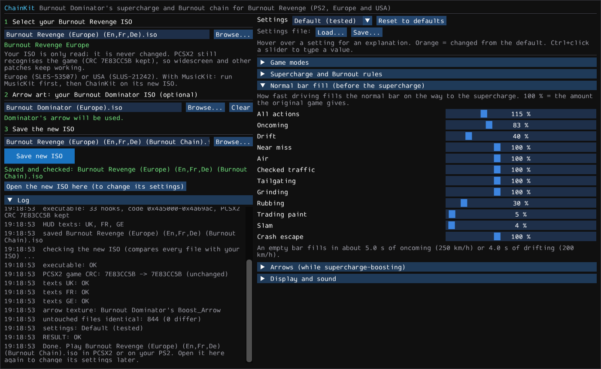
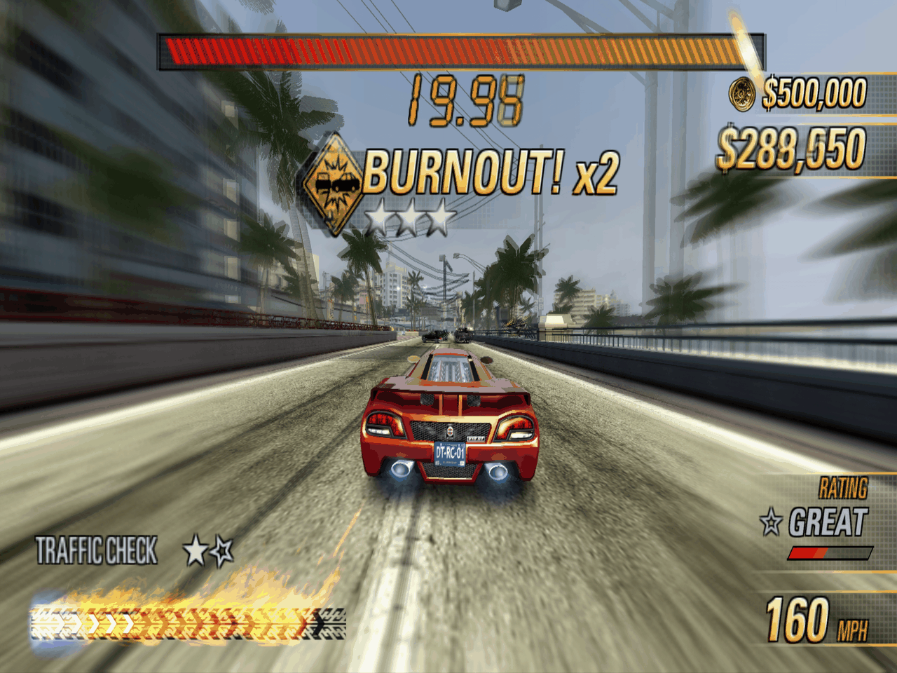
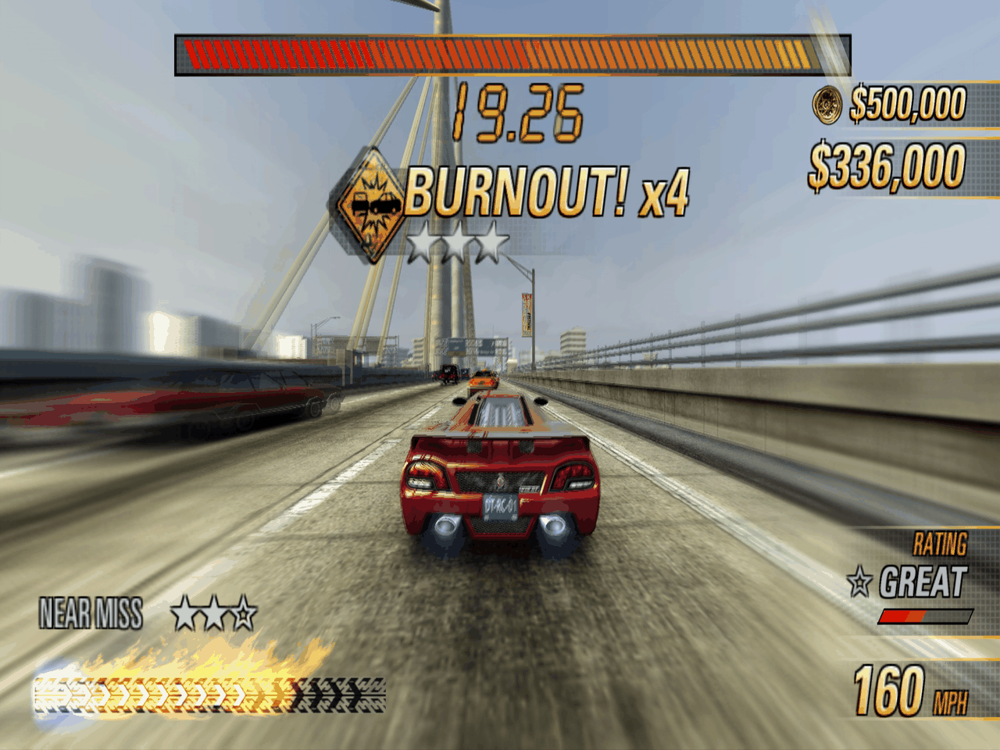
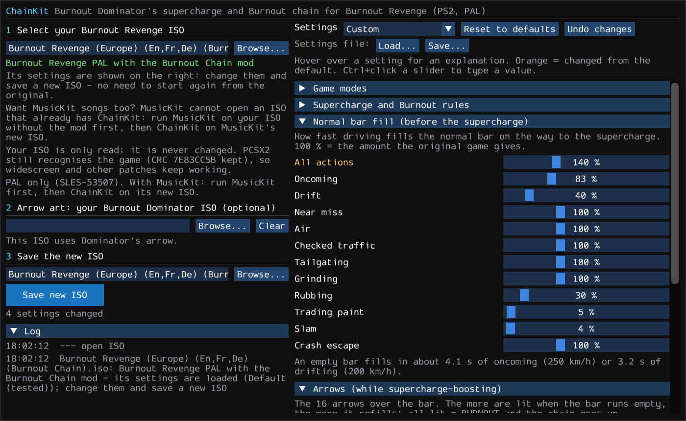

# ChainKit for Burnout Revenge (PS2)

**Burnout Dominator's supercharge and Burnout chain in Burnout Revenge.** Fill your boost bar, it turns blue
(*SUPERCHARGE READY!*), boost it empty while you drive well, and it refills itself: *BURNOUT!*, *BURNOUT! x2*,
*x3* … up to *BURNOUT DOMINATION!* ChainKit writes a new disc image of your own Burnout Revenge with this rule
set built in — and lets you tune every part of it.

> **Unofficial fan-made tool.** Not affiliated with, endorsed or sponsored by Electronic Arts Inc. or Criterion
> Games. You need **your own copy** of the game. See [Legal](#legal) before you use or share anything.

- Works with your own disc image of **Burnout Revenge for PlayStation 2**:
  - Europe / PAL — `SLES-53507`
  - USA / NTSC — `SLUS-21242`
- Your image is **only read, never modified**; ChainKit writes a **new** `.iso`.
- **Burnout Dominator is optional — you do not need it.** It only provides the look of the arrows: the real
  Dominator arrow art, taken from **your own** Burnout Dominator disc image. Without it the arrows use Revenge's own
  chevron; the supercharge, the arrows and the Burnout chain work exactly the same. ChainKit contains no game data.
- **Every rule is a setting** — per game mode, per driving action, colours, pop-ups, sounds — with presets
  (*Default (tested)*, *Dominator rules*, *Easy*, *Hard*). Open an image ChainKit made to change its settings
  later, without starting over.
- Works together with **MusicKit** (run MusicKit first) and **CarKit** images.
- The new image keeps the game's PCSX2 CRC (`7E83CC5B` Europe, `D224D348` USA), so **PCSX2 still recognises the
  game and applies its patches** (widescreen etc.).
- **Tested in PCSX2** with the default settings on the European version (races, Road Rage, Burning Lap). The USA
  version gets the same code; its addresses are found automatically from the European ones (see
  [For modders](#for-modders)).

---

## The rules (as in Burnout Dominator)

| | |
|---|---|
| **Normal bar** | Driving skills fill your boost bar as in Revenge — near misses, oncoming, drifting, air, tailgating, slams … You can boost on it as usual. The bar is always the full 4 segments (Dominator); Revenge's *x2 – x4* label is hidden. |
| **Supercharge** | A **full** bar becomes **supercharged**: it turns blue, *SUPERCHARGE READY!* pops up and a sound plays. A **takedown** supercharges it at once. |
| **Arrows** | While you boost on a supercharged bar it drains 3× faster, and 16 **arrows** over the bar light up from everything in the skill list (near miss, oncoming, drift, air, checked traffic, tailgating, grinding, rubbing). A takedown lights all of them. |
| **BURNOUT!** | When the supercharged bar runs empty it refills to half plus the lit arrows. All arrows lit = a full refill = a **BURNOUT**: the chain goes up (*BURNOUT! x2*, *x3* …, *BURNOUT DOMINATION!* at x10) and you keep boosting. |
| **Partial refill** | Not all arrows lit: the bar refills to at most 80 % and the supercharge is lost (*SUPERCHARGE LOST*). |
| **Losing it** | Letting go of the boost button, wrecking, a hit while you are not boosting, or boosting below 97 km/h (60 mph) for 3 seconds ends the supercharge and the chain. While you supercharge-boost, a hit never takes the bar below half, and the takedown camera does not count as letting go - but letting go once you drive again does (0.3 s to press boost again after the camera). |
| **Not changed** | AI cars, **Crash mode** and **online** races always play exactly like the original game. Every other mode can be switched on or off. |

---

## How it works — 4 steps



### Step 1 — Select your Burnout Revenge ISO
Click **Browse…** (or drop the `.iso` on the window). ChainKit tells you what is on it: the original game,
MusicKit songs, CarKit cars — or the Burnout Chain mod itself (then its settings are loaded, see
[Change the settings later](#change-the-settings-later)).

### Step 2 — Your Burnout Dominator ISO (optional)
**You can skip this step.** Burnout Dominator only changes how the 16 arrows look — the gameplay is the same
without it, and the PCSX2 cheat never uses it.

For Dominator's arrow image, select your own Burnout Dominator disc image (tested with the European version;
ChainKit checks any other version when you select it). ChainKit copies the one
arrow texture from it into the new image (in place of the unused online voice-chat icon). Leave it empty to use
Revenge's own chevron for the arrows.

### Step 3 — Settings
The panel on the right holds every setting, grouped in *Game modes*, *Supercharge and Burnout rules*, *Normal bar
fill*, *Arrows* and *Display and sound*. Hover over any setting for an explanation in plain words; changed
settings turn orange. Start from a preset and change single settings if you like. See the
[settings guide](#settings-guide).

### Step 4 — Save: new ISO or PCSX2 cheat
Choose what to make (see [ISO or PCSX2 cheat?](#iso-or-pcsx2-cheat)):

- **Mod the ISO** — choose where to save it and click **Save new ISO**.
- **PCSX2 cheat (.pnach)** — choose a folder (the ChainKit folder by default; **Use PCSX2 cheats folder** appears
  when ChainKit finds one) and click **Save PCSX2 cheat**. See [Install the cheat](#install-the-pcsx2-cheat).

For the new ISO: ChainKit writes the new image and then **checks** it: every file
it did not change is compared with your ISO byte by byte, the PCSX2 CRC, the new texts and the arrow texture are
verified. The log shows the result (*RESULT: OK*). Load the new `.iso` in PCSX2 or burn it for your PS2.



## ISO or PCSX2 cheat?

| | Mod the ISO | PCSX2 cheat (.pnach) |
|---|---|---|
| Plays on | PCSX2 **and** a real PS2 (burned disc / OPL) | PCSX2 only |
| Your game files | a new `.iso` next to yours (~4 GB) | none changed - a ~100 KB text file |
| Switch the mod off | play your original ISO | untick it in PCSX2's cheat list (takes effect at the next boot) |
| Arrow art | Dominator's arrow from your Dominator disc (optional) | Dominator's arrow from your Dominator disc (optional; the cheat file then contains it - personal use only, do not share), otherwise Revenge's own chevron (hard to see) |
| Pop-up texts | in every language of your disc | English |
| Settings | all | all (same code, same settings) |

Both are the same mod: the cheat writes exactly the memory the modded ISO has (checked by the tests). Differences:
the pop-up texts come from the cheat itself (English), and Dominator's arrow is copied from the cheat into the
game's unused online voice-chat icon in memory (the ISO version replaces it in the disc's texture file). **Choose
your Burnout Dominator ISO in step 2 for the cheat too** - Revenge's chevron is barely visible on the bar.

### Install the PCSX2 cheat
1. Save the cheat with ChainKit (window: **PCSX2 cheat (.pnach)**; command line: `pnach --iso "Burnout Revenge.iso"`).
   The file is called `SLES-53507_7E83CC5B_chainkit.pnach` (Europe) or `SLUS-21242_D224D348_chainkit.pnach` (USA).
   PCSX2 loads **every** `<serial>_<CRC>*.pnach` in its cheats folder, so other cheats for the game (e.g. a
   `SLES-53507_7E83CC5B.pnach`) are not replaced.
2. Put it into PCSX2's **cheats** folder (or save it there directly): Windows `Documents\PCSX2\cheats` (portable
   installs: `cheats` next to `pcsx2-qt.exe`), macOS `~/Library/Application Support/PCSX2/cheats`, Linux
   `~/.config/PCSX2/cheats`.
3. In PCSX2: right-click the game → **Properties → Cheats**, tick **Burnout Chain (ChainKit)** (and **Enable
   Cheats** if PCSX2 asks).
4. **Boot the game** (or restart it): the cheat is written once when the game starts.

Notes: use your ISO **without** ChainKit (never the cheat together with a ChainKit ISO - ChainKit refuses to make a
cheat from such an ISO). MusicKit / CarKit ISOs are fine. Other cheats: `pnach-check` (or `pnach --check-with`)
lists memory both write - none with Nehalem's Single Event Mod. Other versions of the game (Japan, other
executables) are not supported.

### In the game
Supercharge-boosting with the arrows lighting up over the bar. Every full refill is a **BURNOUT**, and the chain
counts up in the pop-up (Burnout Revenge USA in PCSX2):





### Change the settings later
Select an image ChainKit made in step 1: its settings appear on the right. Change them and save another **new**
`.iso` — only the game executable changes (and the arrow art, if you now add a Dominator image), so there is no
need to start again from the original. **Undo changes** goes back to the settings of the opened image.



---

## Settings guide

All settings, in the window and on the command line. The window shows them in human units; `chainkit-cli
settings --raw` lists the raw names and values used by `--set` and by settings files.

### Presets
| Preset | What it is |
|---|---|
| **Default (tested)** | The settings tested in PCSX2: Dominator's rules with Revenge's driving, a little faster to fill (an empty bar fills in ~5 s of oncoming or ~4 s of drifting). |
| **Dominator rules** | Closer to Dominator: no boost earning while boosting on a normal bar; no wait before a new supercharge. |
| **Easy** | Fills faster, drains slower (×2), refills more (90 %), no slow-speed rule. |
| **Hard** | Fills slower, drains faster (×3.5), refills less (70 %), slow-speed rule from 113 km/h (70 mph) after 2 s, no earning while boosting. |

### Game modes
Tick the modes that use the mod: **Race and Grand Prix**, **Road Rage**, **Burning Lap**, **Preview Lap**,
**Eliminator**, **Traffic Attack**, **Split-screen races**, **Other events**. A mode that is switched off plays
like the original game. Crash mode and online races are always the original game.

### Supercharge and Burnout rules
| Setting | Default | Meaning |
|---|---|---|
| Always the full 4-segment bar | on | Off: Revenge's own bar sizes (the bar grows with takedowns, shrinks when you crash). |
| Only boost while the button is held | on | Your car boosts only while you hold the boost button. ChainKit reads your boost control itself every frame (any control scheme), so a boost the button does not back - one the game keeps going after a takedown, a Perfect Start, the takedown camera - stops at once. Off: Revenge's own behaviour. |
| No boost earning while boosting | off | Dominator rule: while boosting on a normal bar, driving gives no boost. |
| Supercharged boost drains faster | ×3 | How much faster a supercharged bar empties. |
| Refill base | 50 % | A supercharged bar that runs empty refills to this plus the lit arrows (also the size of the arrow pool). |
| Partial refill | 80 % | Most a bar refills to when not all arrows were lit (and the supercharge is lost). |
| Bar counts as full at | 98 % | The bar supercharges from this level (the game may keep it just below 100 % while you boost). |
| Lose the supercharge when too slow / below / for | on, 97 km/h, 3 s | The slow-speed rule. |
| Takedown camera grace | 5 s | After a takedown a hit while you are not boosting does not end the supercharge within this time. (Letting go of boost is judged by who drives: while the game drives your car - takedown camera - it never counts; once you drive again you have 0.3 s to press boost, otherwise it is a release. With *Only boost while the button is held* off, Revenge's timing: the grace also covers letting go.) |
| Wait before supercharging again | 3 s | After a supercharge was lost. |
| Full while boosting: wait | 0 s | A bar that becomes full while you boost supercharges after this time. |
| Pause after a refill | 0.6 s | The bar does not drain for this long after it supercharged or refilled. |
| BURNOUT DOMINATION! at chain / WOW above | 10 / 999 | Pop-up texts for long chains (999 = never). |

### Normal bar fill (before the supercharge)
How fast each action fills the normal bar, in % of what the original game gives. **All actions** (115 %) multiplies
every single action: **Oncoming** 83 %, **Drift** 40 %, **Near miss**, **Air**, **Checked traffic**,
**Tailgating**, **Grinding**, **Crash escape** 100 %, **Rubbing** 30 %, **Trading paint** 5 %, **Slam** 4 % (a slam
gives a lot in Revenge; 4 % is about 1/6 of the bar). The window shows how many seconds of oncoming / drifting fill
an empty bar.

### Arrows (while supercharge-boosting)
| Setting | Default |
|---|---|
| All actions | 100 % |
| Near misses for all arrows / checked cars for all arrows | 2.9 / 2.9 |
| Oncoming: seconds for all arrows (at ~250 km/h) | 4.8 s |
| Drift: seconds for all arrows (at ~200 km/h) | 4.0 s |
| Air: metres for all arrows | 50 m |
| Tailgating / grinding / rubbing: seconds for all arrows | 4 s / 20 s / 20 s |
| Slams for all arrows | 6 |
| Takedown lights | 100 % of the arrows |

### Display and sound
**Bar fire while the bar fills up** (off: the fire on the boost bar shows only while you really boost; Revenge also shows it while a refill is animated), **Debug: show stopped boosts** (pop-ups for testing), pop-up messages, sounds, the blue bar, the arrows (each can be switched off), **Show the x2 – x4 bar-size label**
and **Show the PRESS R1 TO BOOST hint** (both hidden by default), and the colours of lit arrows, unlit arrows and
their outline.

### Settings files
**Save…** / **Load…** above the settings write and read a small `.json` file — to keep your favourite settings,
share them, or use them with the command line (`--settings FILE.json`). Dropping a settings file on the window
loads it too.

---

## Requirements

| What | Details |
|---|---|
| Operating system | Windows 10 or 11 (64-bit), macOS 14 Sonoma or newer (Apple Silicon or Intel), or 64-bit Linux (x86_64 or aarch64, glibc 2.28+; tested on Ubuntu 22.04 / 24.04) |
| Python | 3.11 or newer — <https://www.python.org/downloads/> |
| Python packages | installed automatically by `setup.bat` / `setup.command` / `setup.sh` into a private `.venv`: numpy, glfw, PyOpenGL, imgui-bundle, Pillow, pytest (see [requirements.txt](requirements.txt)) |
| Graphics | any GPU with OpenGL 3.3 (for the ChainKit window) |
| Disk space | about 4.5 GB free for the new disc image plus ~300 MB for the Python packages |
| The game | your own disc image (.iso) of Burnout Revenge for PS2: Europe `SLES-53507` or USA `SLUS-21242` |
| Optional | your own disc image of Burnout Dominator (PS2) for the arrow art |
| Internet | only once, during `setup.bat` / `setup.command` / `setup.sh` |

## Installation (Windows 10 / 11)

1. Install **Python 3.11 or newer** from <https://www.python.org/downloads/> (tick *"Add python.exe to PATH"*).
2. Download this repository (green **Code** button → *Download ZIP*) and unpack it, or `git clone` it.
3. Double-click **`setup.bat`** once. It creates a private Python environment in `.venv`. Nothing is installed
   system-wide.
4. Start **`ChainKit.bat`**. Settings and the log (`gui.log`) are kept in `%APPDATA%\chainkit`.

## Installation (macOS)

For Apple Silicon (M1 and newer) and Intel Macs with macOS 14 Sonoma or newer.

1. Install **Python 3.11 or newer** from <https://www.python.org/downloads/macos/> (or with
   [Homebrew](https://brew.sh): `brew install python`).
2. Download this repository (green **Code** button → *Download ZIP*) and unpack it, or `git clone` it.
3. Double-click **`setup.command`** once. It opens a Terminal window and creates a private Python environment in
   `.venv`. Nothing is installed system-wide.
   - **First start:** macOS blocks scripts downloaded from the internet (*"cannot be opened because it is from an
     unidentified developer"* / *"Apple could not verify …"*). Right-click (Control-click) `setup.command` →
     **Open** → **Open**. On macOS 15 and newer, if there is no *Open* button: try to open it once, then go to
     *System Settings → Privacy & Security* and click **Open Anyway**. Or clear the download flag of the whole
     folder once in Terminal: `xattr -dr com.apple.quarantine ` followed by the folder (drag it into the Terminal
     window), then Return.
   - If macOS says the file *"could not be executed because you do not have appropriate access privileges"*, the
     unpacking lost the permissions: run `chmod +x *.command *.sh` in Terminal inside the folder.
4. Start **`ChainKit.command`** and keep its Terminal window open while you use ChainKit. Settings and the log
   (`gui.log`) are kept in `~/Library/Application Support/chainkit`.

## Installation (Linux)

For 64-bit Linux on x86_64 or aarch64 (glibc 2.28 or newer; Alpine / musl is not supported). Tested in CI on
Ubuntu 22.04 and 24.04 (x86_64); other distributions (Debian, Fedora, Arch, openSUSE, Mint, ...) should work the same way.

1. Install the system packages. Python 3.11 or newer, and on Debian / Ubuntu the separate `venv` package:
   - Debian / Ubuntu / Mint: `sudo apt install python3 python3-venv python3-pip libgl1 libegl1 libxkbcommon0 zenity`
   - Fedora: `sudo dnf install python3 python3-pip mesa-libGL mesa-libEGL libxkbcommon zenity`
   - Arch / Manjaro: `sudo pacman -S python python-pip mesa libglvnd libxkbcommon zenity`
   - Ubuntu 22.04 has Python 3.10 only: add Python 3.11+ first (deadsnakes PPA, or <https://www.python.org/downloads/>).
   - The window needs OpenGL 3.3 (Mesa or the GPU driver) and an X11 or Wayland session. **`zenity`** (or `kdialog`
     on KDE) is used for the file and folder dialogs; without it, the dialogs do not open. The GLFW and
     imgui-bundle wheels bring everything else.
2. Download this repository (green **Code** button → *Download ZIP*) and unpack it, or `git clone` it.
3. Open a terminal in the folder and run **`./setup.sh`** once. It creates a private Python environment in `.venv`.
   Nothing is installed system-wide. If you get *"Permission denied"*, run `chmod +x *.sh` first.
4. Start **`./ChainKit.sh`** and keep the terminal open while you use ChainKit. Settings and the log (`gui.log`) are kept in
   `~/.config/chainkit` (or `$XDG_CONFIG_HOME/chainkit`).

The Windows version also runs under Wine, but use the native Linux version.

## Command line (optional)

Everything the window does is also available from `chainkit-cli.bat` (Windows) or `./chainkit-cli.sh` (macOS / Linux,
in a terminal).

| Task | Command |
|---|---|
| new image with the default settings | `build --iso "Burnout Revenge (Europe).iso" --out "Burnout Revenge (Burnout Chain).iso"` |
| … with Dominator's arrow art | add `--dominator "Burnout Dominator (Europe).iso"` |
| … with a preset / a settings file / single settings | add `--preset "Dominator rules"` · `--settings my.json` · `--set fill_mult=1.5 --set lit_rgba=1,0.5,0,1` |
| change the settings of an image ChainKit made | `tune "Burnout Revenge (Burnout Chain).iso" "Burnout Revenge (Burnout Chain 2).iso" --set drain_mult=2` |
| what is on an image | `info "Burnout Revenge (Burnout Chain).iso"` |
| list the settings (with the values of an image) | `settings` · `settings "Burnout Revenge (Burnout Chain).iso"` · `settings --raw` |
| list the presets | `presets` |
| save settings to a file | `export "Burnout Revenge (Burnout Chain).iso" my.json` · `export --preset Hard hard.json` |
| check a new image | `validate "Burnout Revenge (Europe).iso" "Burnout Revenge (Burnout Chain).iso"` |
| PCSX2 cheat instead of an ISO | `pnach --iso "Burnout Revenge (Europe).iso" --out-dir cheats` (`--force` replaces an existing file; give `--iso` twice for Europe + USA; `--region pal\|usa\|both`) · or `build --output-type pnach ...` |
| other cheats writing the same memory? | `pnach-check SLES-53507_7E83CC5B_chainkit.pnach --with OTHER.pnach` (also `pnach ... --check-with OTHER.pnach`) |

On/off settings have their own names, so no bit masks are needed: `--set only_boost_while_held=off`, `--set debug_boost=on`, `--set mode_traffic_attack=off` (`settings` lists every name).

Settings are applied in this order: the preset (or, for `tune`, the image's own settings), then `--settings`, then
`--set`. `build` and `tune` check the new image right away (`--no-validate` skips that).

`validate` re-reads the new image and checks it: the executable patch is complete and does not touch MusicKit /
CarKit / PCSX2-patch addresses, the PCSX2 CRC is unchanged, the new texts and the arrow texture are in place,
MusicKit songs are kept, and every other file is byte-identical to your ISO.

## Works with MusicKit and CarKit

- **MusicKit:** run [MusicKit](https://github.com/Bondimm/burnout-revenge-musickit) **first**, then ChainKit on
  MusicKit's new image. ChainKit uses the top of the free space that MusicKit opens for its song list; both fit.
  MusicKit cannot open an image that already has ChainKit — if you want both, start again from your ISO without
  ChainKit (your ChainKit settings: **Save…** them first, then **Load…** them again). ChainKit shows a clear
  message if an image has a song list broken by a tool run after ChainKit.
- **CarKit:** images made with CarKit work in any order — ChainKit and CarKit change different parts of the game.

## FAQ

**PCSX2 says the dump is not in the redump database / the MD5 is red.** That is expected for *any* modified disc
image — it simply is not the original pressing anymore. It does not affect the game or PCSX2 patches: the game CRC
(shown in PCSX2's game properties) stays the same.

**The bar does not turn blue.** It supercharges only from boost you *earned* in this race (a bar that starts full
does not count) and not during the 3 seconds after a supercharge was lost. A takedown supercharges it at once.

**My car kept boosting on its own after a takedown / the bar showed fire without boosting.** Fixed: with *Only boost while the button is held* (on by default) the car boosts only while you hold the button, and the bar fire follows the real boost. Make a new image with the current ChainKit from your ISO without the mod (images from older versions cannot be changed, ChainKit says so).

**Why is there no "x2 / x3 / x4" next to my bar any more?** With the mod the bar is always the full 4 segments, so
the label is hidden (it also covered the arrows). Turn it back on under *Display and sound*. The chain is shown by
the *BURNOUT! xN* pop-ups, as in Dominator.

**Can I play the original game rules in some modes?** Yes: untick the modes under *Game modes*. Crash mode and
online races always play like the original.

**Do I need Burnout Dominator?** No. It only provides the arrow image. Without it the arrows use Revenge's own
chevron and everything else is the same.

**Can I change the settings again later?** Yes — open the image ChainKit made, change the settings, save a new
image. Your Dominator arrow stays.

**Does it work with the USA version of Burnout Revenge?** Yes — Europe (`SLES-53507`) and USA (`SLUS-21242`) are
both supported. The USA version has English texts only, so the pop-ups are in English. Other versions (Japan,
Platinum re-releases with a different executable) are refused with a message.

**Will my save game still work?** Yes. ChainKit changes nothing that is saved on the memory card.

## For modders

The mod is a small block of MIPS code generated by `chainkit/cave.py` (with its own assembler in
`chainkit/mips.py`) and placed in the unused 16 KB `.sndata` gap of the executable (`SLES_535.07` /
`SLUS_212.42`); every patched game address is listed in `cave.hooks()`. The code is written with European
addresses. For the USA build, `tools/derive_region.py` aligns the two executables by masked instruction windows
(jump targets and address immediates masked out) and maps every code address to the aligned instruction and every
data address through the code that uses it; the result is `regions.USA_MAP`. Before patching, ChainKit checks the
original instruction at every hook site, so a wrong address is never written. The tests run the generated code in a
MIPS interpreter against a model of the game's memory (`tests/test_cave*.py`, for both builds), including Crash
mode and every mode switch. Tests that need your disc images are skipped unless you point them to them:

```
set CHAINKIT_ISO=D:\path\to\Burnout Revenge.iso          (read only; Europe or USA)
set CHAINKIT_ISO_PAL=... & set CHAINKIT_ISO_USA=...     (both original discs: re-derive and check USA_MAP)
set CHAINKIT_FULL_TEST=1                                (+ writes two test images: GUI flow test)
set CHAINKIT_DOMINATOR=D:\path\to\Burnout Dominator.iso  (optional)
.venv\Scripts\python -m pytest tests -v
```

## Other Burnout kits

- [Burnout Revenge MusicKit](https://github.com/Bondimm/burnout-revenge-musickit) — add your own songs to the EA
  Trax soundtrack of Burnout Revenge (Europe and USA).
- [Burnout Dominator MusicKit](https://github.com/Bondimm/burnout-dominator-musickit) — the same for Burnout
  Dominator (PS2).
- [Burnout 3: Takedown MusicKit](https://github.com/Bondimm/burnout3-takedown-musickit) — the same for Burnout 3:
  Takedown (PS2).

## Legal

**Please read this before using or sharing anything made with ChainKit.**

- **Unofficial project.** ChainKit is an independent, non-commercial fan project. It is not affiliated with,
  authorised, endorsed or sponsored by Electronic Arts Inc., Criterion Games or Sony Interactive Entertainment.
- **Trademarks.** "Burnout", "Burnout Revenge", "Burnout Dominator", "EA" and related names and logos are
  trademarks of Electronic Arts Inc.; "PlayStation" and "PS2" are trademarks of Sony Interactive Entertainment.
  They are used here only to describe which games this tool works with. All other trademarks belong to their
  owners.
- **No game content is included.** This repository contains only original source code and documentation, plus
  screenshots of the tool. It does not contain or distribute any part of either game — no disc images,
  executables, textures, texts or other data.
- **Bring your own games.** You need your own, legally obtained copy of Burnout Revenge — and, for Dominator's
  arrow art, of Burnout Dominator — and must create the disc images yourself. The arrow image is copied from your
  Burnout Dominator image into your own Burnout Revenge image on your computer. ChainKit does not bypass any copy
  protection; it only edits a copy of your own image.
- **Do not share modified disc images.** Disc images contain the games, which are copyrighted by Electronic Arts.
  Uploading or distributing them — modified or not — is not allowed. Share your settings files instead.
- **No warranty.** The software is provided "as is", without warranty of any kind (see [LICENSE](LICENSE)).
  Use it at your own risk; keep a backup of your original image and your memory card saves.
- **Licence.** The source code is released under the MIT License. The licence applies only to the code in this
  repository and grants no rights to the games or their content.

If you are a rights holder and have a concern about this project, please open an issue and it will be addressed
promptly.
